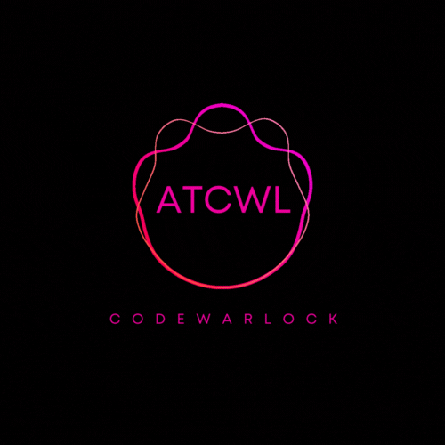
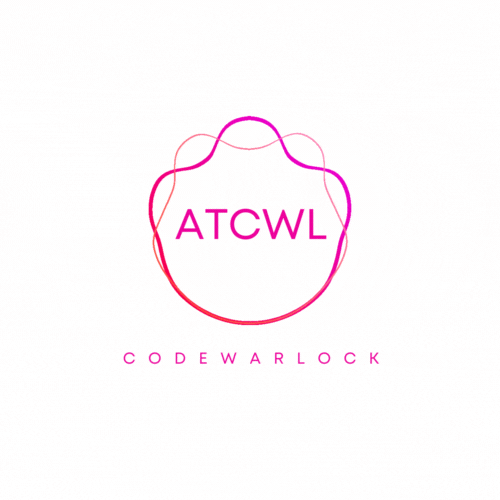

### Hi there, I'm Davies - aka [thecodewarlock] 👋

## I'm a Software Engineer and Cyber security enthusiast!

- 🔭 I’m currently working on Full Stack Web Development (Reactjs, Nodejs, express, Typescript, MongoDb, MySql) projects!
- 🌱 I’m currently learning Reverse Engineering & Understanding Lower Level Applications!
- 👯 I’m looking to collaborate with other content creators
- ⚡ Fun fact: I love Apples and playing basketball

### Connect with me:

&nbsp;&nbsp;

&nbsp;&nbsp;

 
 

 
 

[website]: https://atcwl.github.io
[twitter]: https://twitter.com/atcwl
[linkedin]: https://linkedin.com/in/devisateka
[atcwl]: https://atcwl.github.io

